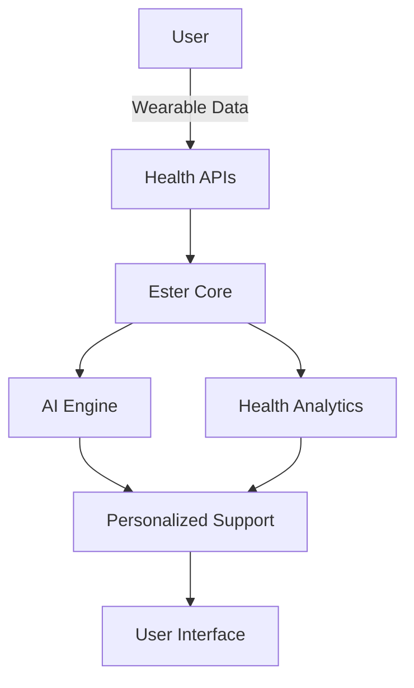

# 🤱 Ester: Your AI Maternal Health Companion

<div align="center">

[](https://opensource.org/licenses/MIT)
[](CONTRIBUTING.md)
[](https://www.w3.org/TR/WCAG21/)
[](https://digitalpublicgoods.net/)
[](https://coderabbit.ai)

</div>

## 🌟 About Ester

Ester is an open-source AI companion designed to support individuals through all stages of maternal health. Starting with postpartum recovery, Ester provides personalized guidance by integrating with health wearables and offering evidence-based support.

**Why Ester?**
- 🤰 **Comprehensive Care**: From pregnancy to postpartum and beyond
- 🔒 **Privacy-First**: Your health data stays yours
- 🌍 **Accessible**: Designed for everyone, everywhere
- 🤖 **AI-Powered**: Evidence-based, personalized support

<div align="center" style="margin: 2.5rem 0;">
  <a href="https://ester.chat" target="_blank">
    
  </a>
  <p style="margin-top: 1.5rem;"><em>Experience Ester's intuitive chat interface</em></p>
</div>

## 📋 Table of Contents

- [✨ Features](#-features)
- [🌍 DPG Compliance](#-dpg-compliance)
- [🚀 Tech Stack](#-tech-stack)
- [🏗️ Architecture](#️-architecture)
- [🎯 Roadmap](#-roadmap)
- [🛠️ Getting Started](#️-getting-started)
- [🤝 Contributing](#-contributing)
- [🌐 Community](#-community)
- [📄 License](#-license)

## ✨ Features

### 🤖 AI Companion
- Personalized health guidance
- 24/7 support for maternal health questions
- Evidence-based recommendations

### 📊 Health Integration (Whoop)
- Real-time health metrics
- Recovery tracking
- Sleep and activity monitoring
- Customized wellness insights

### 🔒 Privacy & Security
- End-to-end encryption
- Open-source transparency
- GDPR/CCPA compliant
- Self-hostable

## 🌍 DPG Compliance

Ester is being developed as a Digital Public Good, committed to:

- ✅ **Open Source**: Full transparency with MIT License
- 🌍 **Global Accessibility**: Multi-language support
- 🔍 **Transparency**: Open development process
- 🤝 **Community Driven**: Built with and for the community

## 🚀 Tech Stack

### Core Platform
- **Frontend**: React Native with Expo
- **AI**: OpenAI API (with plans for open models)
- **Backend**: Supabase (PostgreSQL + Auth)
- **State**: Zustand

### Data & Privacy
- **Encryption**: AES-256
- **Analytics**: Self-hosted Plausible
- **i18n**: react-i18next

## 🏗️ Architecture



## 🎯 Roadmap

### Phase 1: Postpartum Recovery (Current)
- [x] Basic chat interface
- [x] Whoop integration
- [ ] Health insights dashboard
- [ ] Basic AI recommendations

### Phase 2: Pregnancy Support
- [ ] Pregnancy tracking
- [ ] Symptom checker
- [ ] Appointment reminders

### Phase 3: Community & Growth
- [ ] Community forums
- [ ] Healthcare provider portal
- [ ] Research collaboration tools

## 🛠️ Getting Started

### Prerequisites
- Node.js 18+
- npm 9+
- Expo CLI

### Quick Start
```bash
# Clone the repository
git clone https://github.com/yourusername/ester.git
cd ester

# Install dependencies
npm install

# Start development
npm run dev
```

## 🤝 Contributing

We're building Ester as a community. Here's how you can help:

1. 👩‍💻 **Code**: Check out [good first issues](https://github.com/yourusername/ester/issues?q=is%3Aissue+is%3Aopen+label%3A%22good+first+issue%22)
2. 🐛 **Report Bugs**: [Open an issue](https://github.com/yourusername/ester/issues)
3. 📖 **Improve Docs**: Help us make Ester more accessible
4. 🌍 **Translate**: Help us reach more people

See our [Contributing Guide](CONTRIBUTING.md) for details.

## 🌐 Community

- [Discord/Slack]() (Coming Soon)
- [Community Forum]() (Coming Soon)
- [Twitter]() (Coming Soon)

## 📄 License

Ester is open-source software licensed under the [MIT License](LICENSE).

## 🙏 Acknowledgments

- All the amazing parents and healthcare providers who've shared their insights
- Open-source contributors around the world
- The Digital Public Goods Alliance for inspiration

---

<div align="center">
  Made with ❤️ for healthier families everywhere
</div>
